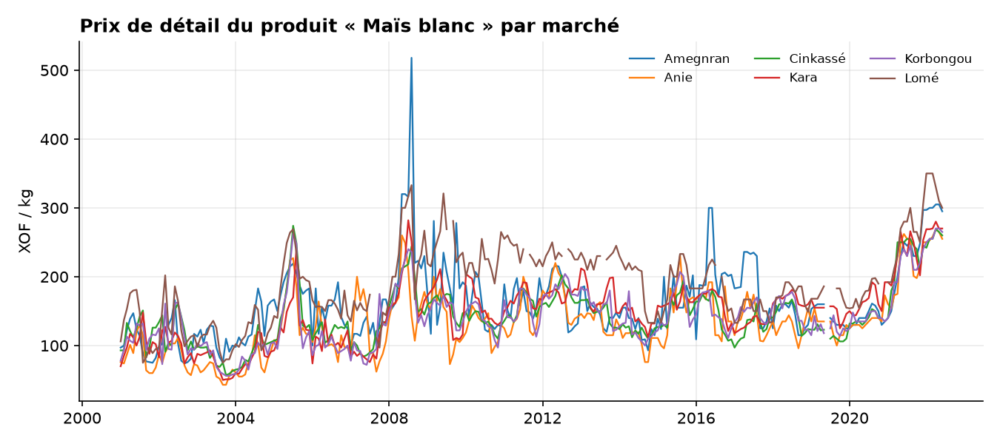
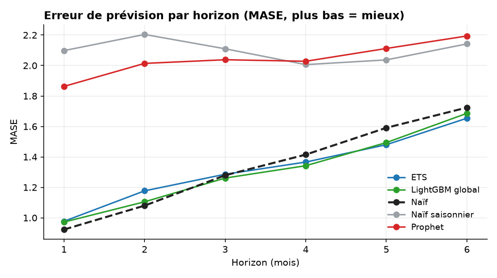
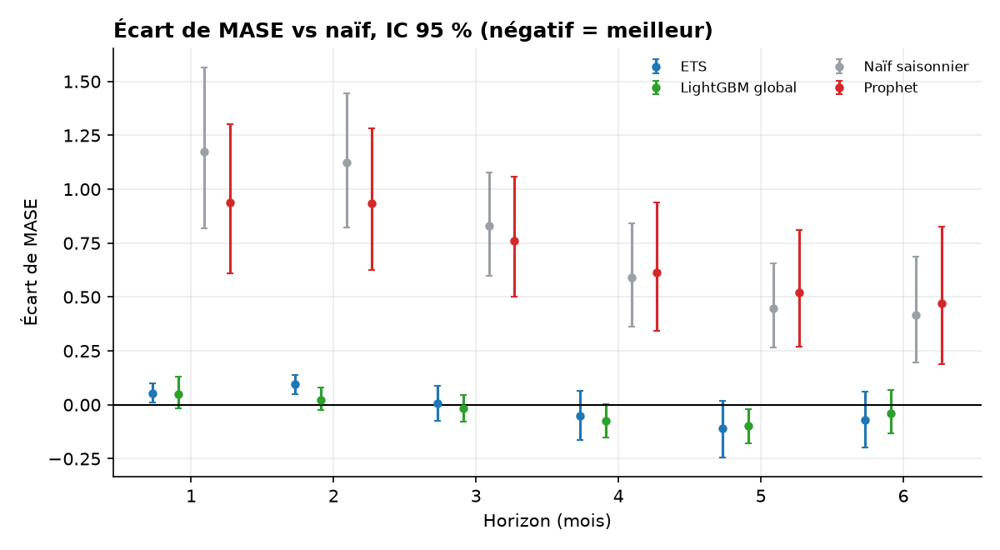
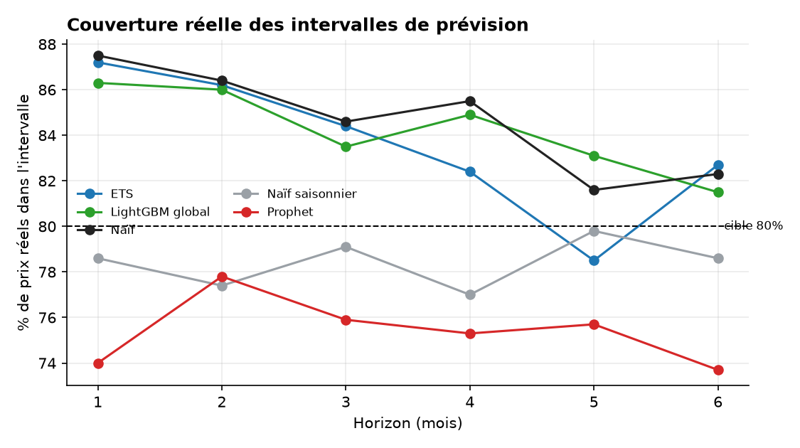
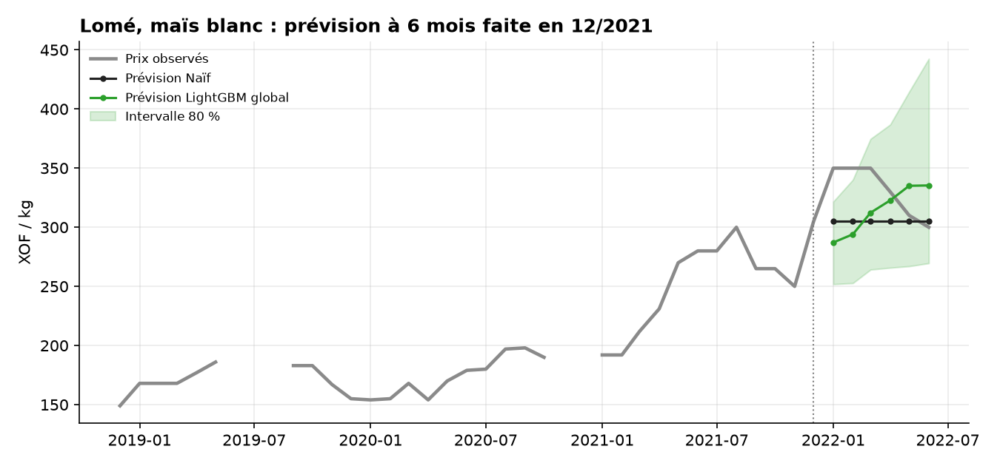

# 🌽 AgroPrice : prévoir les prix des denrées sur les marchés togolais

**Question :** peut-on prévoir à 1-6 mois les prix de détail du maïs, du gari, du riz importé et du sorgho au Togo, et un modèle sophistiqué fait-il mieux que le simple « prix du mois dernier » ?

**Réponse courte :** non, pas de façon fiable. Les prix sont très persistants. Aucun modèle ne bat le repère naïf de manière répétée et statistiquement significative ; Prophet et le naïf saisonnier font significativement **moins bien**. Ce projet sert à le démontrer proprement et à fournir des **intervalles de prévision calibrés**, plus utiles qu'une prévision ponctuelle.

**Données :** prix de détail mensuels du Programme alimentaire mondial (WFP, via HDX), janvier 2001 à juin 2022, 6 marchés (Kara, Lomé, Anié, Amegnran, Korbongou, Cinkassé), 4 produits, 23 séries, en XOF/kg. Les données s'arrêtent en 2022 : les résultats sont des **backtests**, pas des prévisions en temps réel.



## Méthode

- **Validation à origine glissante** : à chaque origine, entraînement uniquement sur le passé, prévision à 1-6 mois (96 mois d'historique minimum, une origine tous les 6 mois). Tests unitaires contre les fuites de données.
- **Métrique : MASE** (erreur rapportée à celle du modèle naïf d'un pas sur l'apprentissage). Comparaison sur les **mêmes 614 cas** pour tous les modèles.
- **Modèles :** naïf, naïf saisonnier, ETS, Prophet, LightGBM global (un seul modèle appris sur les 23 séries, cible = variation logarithmique du prix).
- **Significativité :** bootstrap apparié par date d'origine, IC à 95 % (les marchés subissent les mêmes chocs au même moment, on ne les traite donc pas comme indépendants).
- **Intervalles à 80 % :** quantiles des erreurs logarithmiques déjà connues à la date d'origine (calibration conforme), applicables à tout modèle.

## Résultats

MASE moyen par horizon en mois (plus bas = mieux) :

| Modèle | 1 | 2 | 3 | 4 | 5 | 6 |
|---|---|---|---|---|---|---|
| Naïf (dernier prix) | **0,92** | **1,08** | 1,28 | 1,42 | 1,59 | 1,72 |
| ETS | 0,98 | 1,18 | 1,28 | 1,37 | **1,48** | **1,65** |
| LightGBM global | 0,97 | 1,11 | **1,26** | **1,34** | 1,49 | 1,69 |
| Prophet | 1,86 | 2,01 | 2,04 | 2,03 | 2,11 | 2,20 |
| Naïf saisonnier | 2,10 | 2,20 | 2,11 | 2,01 | 2,04 | 2,14 |



### Les écarts sont-ils significatifs ?

Écart de MASE par rapport au naïf (négatif = meilleur), `*` = IC à 95 % excluant zéro :

| Modèle | 1 | 2 | 3 | 4 | 5 | 6 |
|---|---|---|---|---|---|---|
| ETS | +0,054* | +0,096* | +0,005 | −0,050 | −0,113 | −0,072 |
| LightGBM global | +0,049 | +0,024 | −0,018 | −0,073 | −0,097* | −0,038 |
| Prophet | +0,94* | +0,93* | +0,76* | +0,61* | +0,52* | +0,47* |
| Naïf saisonnier | +1,18* | +1,12* | +0,83* | +0,59* | +0,45* | +0,42* |



**Ce qu'on peut affirmer :**
1. Prophet et le naïf saisonnier sont **significativement moins bons** que le naïf à tous les horizons.
2. À 1-2 mois, ETS est même significativement moins bon que le naïf.
3. LightGBM n'est significativement meilleur qu'à **un seul horizon sur six** (5 mois). Avec 12 comparaisons, un résultat isolé peut être dû au hasard : je ne le présente pas comme une victoire.
4. 2020-2022 est plus difficile pour tous : le naïf y est le meilleur (MASE 1,21 contre 1,26 pour ETS et LightGBM), alors qu'avant 2020 ETS et LightGBM font légèrement mieux (1,33 et 1,32 contre 1,36).

**Hypothèse non testée :** Prophet, qui ajuste une tendance lisse et une saisonnalité annuelle, ignore le niveau récent du prix, information la plus utile ici.

### Intervalles de prévision à 80 %

| Modèle | Couverture réelle (h=1 à 6) | Largeur relative moyenne (h=1 → 6) |
|---|---|---|
| Naïf | 82 % à 88 % | 0,32 → 0,55 |
| ETS | 79 % à 87 % | 0,31 → 0,51 |
| LightGBM global | 82 % à 86 % | 0,32 → 0,51 |
| Prophet | 73 % à 78 % | 0,44 → 0,48 |
| Naïf saisonnier | 77 % à 80 % | 0,61 → 0,58 |

Les intervalles du naïf, d'ETS et de LightGBM sont **bien calibrés** (légèrement conservateurs). Ceux de Prophet sont trop étroits (73 à 78 % de couverture) et ceux du naïf saisonnier légèrement, probablement parce que leurs erreurs récentes dépassent celles de la période de calibration (hypothèse non vérifiée). Un intervalle d'environ ±15 à 30 % du prix donne une idée honnête de l'incertitude réelle.





## Dashboard

```bash
streamlit run app/streamlit_app.py
```

Choix du produit, du marché et du modèle ; prévisions avec intervalles ; alertes de hausse anormale (variation sur 3 mois supérieure à 2 écarts-types des 60 mois précédents) ; performance des modèles ; méthode.

## Reproduire

Windows (cmd) :

```bat
py -m venv .venv
.venv\Scripts\activate
pip install -r requirements.txt
pip install -e .
python -m pytest -q
python scripts/run_all.py
streamlit run app/streamlit_app.py
```

macOS/Linux : `source .venv/bin/activate` à la place de l'activation Windows. `run_all.py` enchaîne le backtest (environ 2 minutes, Prophet inclus) puis la génération du rapport (significativité, intervalles, alertes, prévisions, graphiques).

## Structure

```
src/agroprice/   data, models, global_model, evaluate, significance, intervals, alerts, forecast, plots
scripts/         run_backtest.py, make_report.py, run_all.py
app/             streamlit_app.py (+ requirements.txt minimal pour le déploiement)
tests/           15 tests (fuites de données, métriques, intervalles, alertes, dashboard)
results/         sorties CSV du backtest et du rapport
figures/         graphiques du README
```

## Limites

- Données arrêtées en juin 2022 et 6 marchés seulement : les prévisions du dashboard partent de cette date et illustrent la méthode.
- Pas de variables explicatives (pluie, carburant, taux de change, conflits, frontières).
- Le bootstrap par origine suppose peu de dépendance entre origines espacées de 6 mois ; 27 origines seulement.
- 12 comparaisons simultanées sans correction formelle.
- Alertes : seuil de 2 écarts-types choisi a priori, non optimisé.

## Pistes suivantes

- [ ] Données WFP plus récentes si disponibles sur HDX
- [ ] Variables exogènes (pluie CHIRPS, prix du carburant)
- [ ] Étude de la rupture 2020-2022 (modèle avec changement de régime)
- [ ] Déploiement du dashboard (Streamlit Community Cloud ou Hugging Face Spaces)

## Source et licence des données

WFP Food Prices for Togo, Humanitarian Data Exchange. Vérifier la licence en vigueur sur la page HDX avant toute redistribution.
